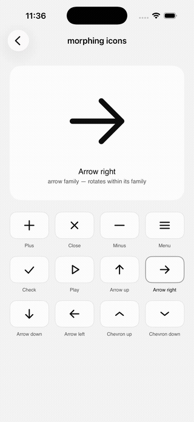

# Morphing Icons

A SwiftUI icon component where any icon can smoothly morph into any other.

<p align="center">
  
</p>

<p align="center"><a href="demo.mov">Full-quality screen recording</a></p>

Every icon is built from the same raw material — exactly three line segments — so any icon can become any other icon by moving twelve coordinates, rotating, or both.

## The three rules

1. **Exactly three lines.** Every icon is three line segments in a unit square, drawn with round caps.
2. **Collapse, don't disappear.** Icons that need fewer lines (minus, check, chevrons) park the extras as zero-length segments at the icon's center. Collapsed lines fade out in sync with the shrink, so the round cap never leaves a visible dot.
3. **Rotate when shapes match.** Icons that share geometry at different rotations — the four arrows, the chevrons, plus → close — belong to a *family* and morph by shortest-arc rotation instead of coordinate interpolation. Arrow right → arrow down turns 90°; it never scrambles endpoints.

## Icon catalog

Plus · Close · Minus · Menu · Check · Play · Arrow up/right/down/left · Chevron up/down

All twelve are interchangeable. Line orderings are chosen so the classic pairs look right: menu → close does the hamburger-to-X (outer bars become the diagonals, middle bar collapses), plus → minus shrinks the vertical bar, arrow → chevron grows or collapses the shaft from center.

## Three morph styles

A sliding segmented switch under the grid toggles how the morph treats non-geometry:

- **Blur** — a blur pulse masks the morph; collapsed lines fade out
- **Fade** — collapsed lines fade out, no blur
- **Raw** — pure geometry, nothing hidden: collapsed lines visibly shrink to round-cap dots at the center

The component takes it as a parameter: `MorphingIconView(icon: .check, style: .raw)`.

## Interaction details

- **Spring-driven and interruptible.** Morphs use a spring (`response: 0.3, dampingFraction: 0.8`) so they retarget continuously when interrupted mid-animation.
- **No jumps under rapid tapping.** Cross-family morphs are expressed in the current rotation frame, and rotation morphs only engage from a settled state — interrupted morphs fall back to coordinate interpolation, which retargets smoothly.
- **Soft blur pulse.** A blur (0.6 × line width) snaps in as a morph begins and dissolves as the spring settles, masking the lines moving and fading so the change reads as one transformation.
- **Press feedback.** Grid cells scale to 0.96 on press (160 ms ease-out).
- **Blur-masked labels.** The icon name swaps with `.blurReplace`, so the change reads as one transformation instead of two overlapping texts.
- **Staggered entrance.** Grid cells cascade in with a 25 ms stagger on first appear only.
- **Reduced motion.** With Reduce Motion enabled, morphs become a quick crossfade — opacity survives, movement goes.

## Usage

Drop `MorphingIconsScreen.swift` into any SwiftUI iOS app target. `FontShim.swift` provides system-font fallbacks for the demo screen's font helpers; delete it if your project already has Open Sauce One wired up.

The component itself is independent of the demo screen:

```swift
MorphingIconView(icon: .arrowRight, lineWidth: 10, color: .primary)
```

Change the `icon` value and the view morphs to it. Defining a new icon is three lines and a rotation:

```swift
static let equals = MorphIcon(
    id: "equals", name: "Equals", family: nil,
    lines: [
        IconLine(start: CGPoint(x: 0.14, y: 0.38), end: CGPoint(x: 0.86, y: 0.38)),
        .collapsed,
        IconLine(start: CGPoint(x: 0.14, y: 0.62), end: CGPoint(x: 0.86, y: 0.62))
    ],
    rotationDegrees: 0
)
```

## Requirements

iOS 18+ (uses `.blurReplace` and `withAnimation` completion callbacks).
